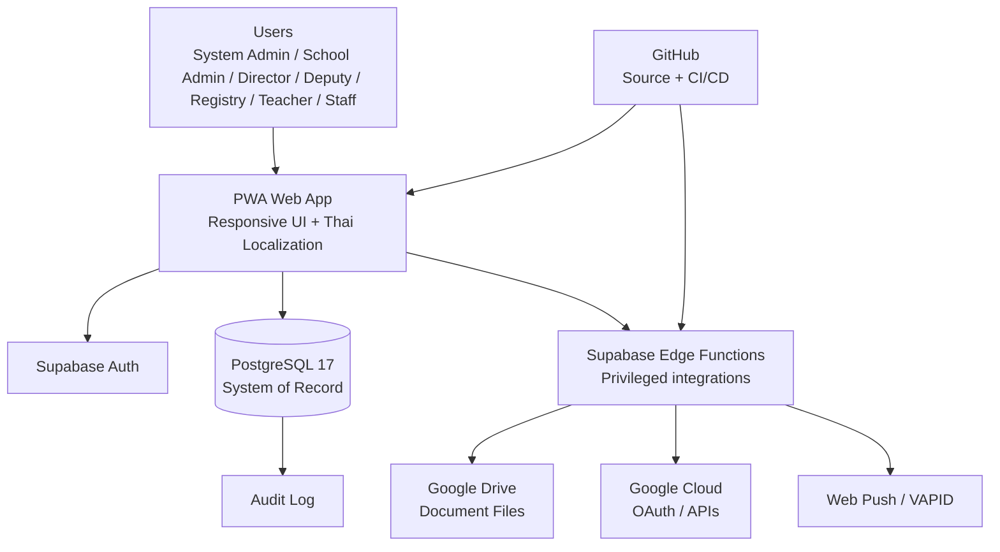

# Architecture — WBNS Electronic Document System

**Project:** ระบบสารบรรณอิเล็กทรอนิกส์ โรงเรียนวัดบึงน้ำใส  
**Repository:** `wbns-edoc/wbns-edoc.github.io`  
**Supabase Project:** `wbns-edoc` (`iigzzwyfxxtqbgjawyom`)  
**Region:** Singapore (`ap-southeast-1`)  
**Database:** PostgreSQL 17  
**Status:** Phase 1 — Architecture & Data Design

## 1. Architecture Principles

1. โรงเรียนวัดบึงน้ำใสใช้ infrastructure แยกเป็นของตนเองโดยสมบูรณ์
2. Google Drive เป็น document-file storage หลัก; ไม่ใช้ Supabase Storage เป็นค่าเริ่มต้น
3. Supabase PostgreSQL เป็น system-of-record สำหรับ metadata, workflow, permissions, audit และ notification state
4. Frontend เป็น PWA รองรับ desktop/mobile และภาษาไทย
5. Supabase Auth เป็น identity provider หลัก
6. ทุกตารางใน exposed schema ต้องมี RLS และ policy ตามสิทธิ์จริง
7. ห้ามใช้ `raw_user_meta_data` เป็น authorization source; role/permission ต้องอยู่ในฐานข้อมูลหรือ app metadata ที่ควบคุมโดยระบบ
8. Secrets และ service credentials ต้องอยู่ใน secure secret management/Edge Functions เท่านั้น
9. Production schema จะถูกสร้างผ่าน versioned migrations หลัง design review
10. ทุกการเปลี่ยนแปลงสำคัญต้องมี audit trail

## 2. Logical Architecture



## 3. Core Database Domains

### Identity & Organization
- `profiles`
- `roles`
- `permissions`
- `role_permissions`
- `user_roles`
- `departments`
- `units`

### Correspondence
- `incoming_documents`
- `outgoing_documents`
- `document_registers`
- `document_numbers`
- `senders`
- `urgency_levels`
- `document_statuses`
- `assignments`

### Workflow
- `workflows`
- `workflow_steps`
- `approvals`
- `transfers`
- `deadlines`
- `comments`
- `escalations`

### Files & Reporting
- `google_drive_files`
- `attachments`
- `reports`
- `legacy_imports`
- `settings`

### Notifications & Audit
- `notifications`
- `notification_preferences`
- `push_subscriptions`
- `notifications_log`
- `audit_logs`

## 4. Roles

| Role | Scope |
|---|---|
| System Admin | Full technical administration |
| School Admin | School configuration, users and permissions |
| Director | Approval, oversight, important-event notifications |
| Deputy Director | Approval/oversightตามที่ได้รับมอบหมาย |
| Registry Officer | รับ/ส่ง/ลงทะเบียน/เลขหนังสือ/จัดเก็บ |
| Teacher | งานที่ได้รับมอบหมายและงานที่เกี่ยวข้อง |
| Staff | งานที่ได้รับมอบหมายและงานที่เกี่ยวข้อง |

Authorization must be evaluated from role/permission tables, not from client-supplied values.

## 5. Document Workflow

Minimum statuses:

- ร่าง
- รออนุมัติ
- อนุมัติแล้ว
- รับเรื่องแล้ว
- ลงทะเบียนแล้ว
- มอบหมายแล้ว
- กำลังดำเนินการ
- เสร็จสิ้น
- จัดเก็บแล้ว
- ส่งแล้ว
- ยกเลิก

Urgency:

- ปกติ
- ด่วน
- ด่วนมาก
- ด่วนที่สุด

A document transition must be recorded with actor, timestamp, previous status, new status, and optional reason.

## 6. RLS Model

RLS will be designed around these rules:

- Anonymous users cannot read business data.
- Authenticated users can only access rows permitted by their effective permissions.
- Registry Officers can operate registry workflows within their authorized scope.
- Teachers/Staff can read and update only assigned/authorized work.
- Directors/Deputies can access oversight and approval records within their scope.
- Admin roles can administer configuration according to explicit permissions.
- UPDATE policies must include both `USING` and `WITH CHECK`.
- Privileged operations should be implemented in controlled Edge Functions or tightly scoped database functions; avoid unnecessary `SECURITY DEFINER`.

RLS tests must cover allow/deny cases for anonymous and authenticated access before production release.

## 7. Notification Rules

### Director / Deputy Director
Receive important system events such as:
- new important incoming document
- approval request
- overdue/escalated task
- urgent/critical correspondence
- workflow completion requiring oversight

### Teacher / Staff
Receive only:
1. tasks assigned to me
2. tasks approaching deadline

Channels:
- in-app notification
- Web Push / Mobile Push
- email only if later enabled/configured

## 8. Google Drive Model

Database stores metadata and references; Google Drive stores actual document files.

Recommended structure:

```
โรงเรียนวัดบึงน้ำใส/
└── ระบบสารบรรณอิเล็กทรอนิกส์/
    ├── หนังสือรับ/
    ├── หนังสือส่ง/
    ├── เอกสารงานสารบรรณ/
    ├── ปี 2569/
    └── ปี 2570/
```

The application must never expose Google service credentials to the browser.

## 9. Security Baseline

- HTTPS/TLS only
- Supabase Auth sessions
- Publishable key in frontend only
- Never expose service-role/secret keys
- RLS on every exposed business table
- Least-privilege grants
- Audit logging for privileged and document lifecycle actions
- Validate uploaded file metadata and allowed file types
- No credentials committed to Git
- Environment-specific secrets
- Backup/recovery procedure documented before go-live

## 10. Performance Baseline

Initial indexes will target:
- document registration number
- document number/year
- sender
- status
- urgency
- assigned user
- department/unit
- deadline
- created_at
- workflow/document foreign keys

Use composite/partial indexes only where query patterns justify them. Foreign-key columns used in joins/filtering should be indexed.

## 11. External Integration Boundaries

### Google Cloud
Own project for WBNS only:
- OAuth credentials
- Google APIs
- Drive integration

### Web Push
Own VAPID key pair for WBNS only.

### Supabase
Own project:
- Auth
- PostgreSQL
- Edge Functions
- Realtime only where justified

No credentials, data, users, files, or keys may be shared with another school's environment.

## 12. Phase 1 Deliverables

Before schema implementation:

- [x] Infrastructure ownership identified
- [x] GitHub repository confirmed
- [x] Supabase project created and healthy
- [x] Architecture diagram created
- [x] Logical database domains defined
- [x] Roles and notification model defined
- [x] RLS strategy defined
- [ ] Detailed ERD
- [ ] Migration SQL
- [ ] RLS policies + automated tests
- [ ] Google Cloud project/OAuth
- [ ] Google Drive integration credentials
- [ ] Web Push/VAPID credentials
- [ ] Application implementation

## 13. Important Supabase Design Note

New public-schema tables are not automatically exposed to the Supabase Data API on current projects, so the implementation must explicitly decide which tables are exposed and pair grants with RLS. This is intentional for security and should be treated as part of the API design rather than worked around by broad grants.

---

**Next engineering gate:** detailed ERD + normalized schema + RLS matrix. No Production DDL is performed by this document.
