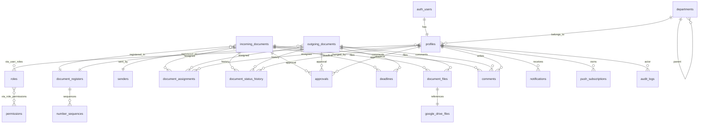

# Detailed ERD — WBNS Electronic Document System

## Design goals
- Normalized PostgreSQL model (3NF where practical)
- UUID primary keys for entities
- Explicit foreign keys with deliberate ON DELETE behavior
- Separate document metadata from file objects
- Separate workflow state/history from current document state
- Separate authorization from user profile data
- Thai document numbering is modeled by register/year/number, not as a single free-text field

## ERD



## Core entities

### profiles
Maps `auth.users.id` to school user information.
- id UUID PK/FK to auth.users
- employee_code
- full_name
- email
- phone
- department_id FK
- is_active
- created_at, updated_at

### roles / permissions
RBAC catalog.
- roles(id, code, name, description)
- permissions(id, code, name, description)
- user_roles(user_id, role_id, assigned_at, assigned_by)
- role_permissions(role_id, permission_id)

### departments
Organizational scope.
- id
- parent_id nullable self-FK
- code unique
- name
- is_active

### document_registers
Registry definition by direction/year.
- id
- code (e.g. IN/OUT)
- name
- direction enum: incoming/outgoing
- fiscal_or_document_year
- is_active
- unique(direction, fiscal_or_document_year)

### number_sequences
Controlled numbering source.
- id
- register_id FK
- year
- current_number
- prefix
- unique(register_id, year)

Number allocation must be transactional; never calculate `MAX(number)+1`.

### senders
External/internal sending organization.
- id
- organization_name
- department_name nullable
- address/contact metadata
- is_active

### incoming_documents
Incoming correspondence.
- id
- register_id FK
- sender_id FK
- external_document_no
- external_document_date
- received_at
- registered_at
- registered_number
- subject
- urgency
- status
- assigned/current owner references
- confidentiality/classification where required
- created_by
- created_at, updated_at

### outgoing_documents
Outgoing correspondence.
- id
- register_id FK
- outgoing_document_no
- document_date
- recipient_name
- recipient_address/contact metadata
- subject
- urgency
- status
- created_by
- created_at, updated_at

### document_assignments
Task handoff.
- id
- document_type + document_id (or implementation-specific parent FK strategy)
- assignee_id
- assigned_by
- assigned_at
- accepted_at
- completed_at
- instructions
- assignment_status

**Implementation note:** PostgreSQL cannot enforce a conventional FK against two alternative parent tables. The final migration should choose one of:
1. a shared `documents` supertype table (preferred), with incoming/outgoing detail tables; or
2. separate assignment tables per direction.

The preferred design is the shared `documents` supertype to preserve referential integrity.

## Recommended refinement: shared documents supertype

Instead of duplicating lifecycle data, use:

```
documents
  ├── incoming_document_details
  └── outgoing_document_details
```

Shared `documents` fields:
- id
- document_type
- register_id
- subject
- urgency
- status
- created_by
- current_owner_id
- created_at
- updated_at

This makes assignments, statuses, approvals, deadlines, comments, files and audit references use one FK.

## Workflow entities

### document_status_history
Immutable transition log:
- id
- document_id
- from_status
- to_status
- changed_by
- changed_at
- reason

### approvals
- id
- document_id
- approval_step
- approver_id
- decision
- decided_at
- comment

### deadlines
- id
- document_id
- due_at
- completed_at
- assigned_to
- reminder_at
- escalation_at
- status

### comments
- id
- document_id
- author_id
- body
- created_at
- edited_at

## Files

### google_drive_files
- id
- drive_file_id UNIQUE
- drive_url
- name
- mime_type
- size_bytes
- checksum nullable
- folder_id nullable
- created_by
- created_at

### document_files
- id
- document_id
- google_drive_file_id
- file_role
- version_no
- is_current
- uploaded_by
- uploaded_at

Actual binary content remains in Google Drive.

## Notification entities

### notifications
- id
- recipient_id
- document_id nullable
- type
- title
- body
- priority
- read_at
- created_at

### push_subscriptions
- id
- user_id
- endpoint UNIQUE
- p256dh
- auth
- user_agent
- created_at
- revoked_at

### audit_logs
Append-only event record:
- id
- actor_id nullable for system events
- action
- entity_type
- entity_id
- old_data JSONB nullable
- new_data JSONB nullable
- request_id nullable
- created_at

## Integrity rules

1. `documents.current_owner_id` must reference an active profile when set.
2. Registered numbers are unique within register + year.
3. Number allocation uses row locking/transactional function.
4. Status changes are recorded before/with the current-state update.
5. Audit logs are append-only for application roles.
6. Document files reference existing Google Drive metadata.
7. Deleting a business document should normally be prohibited; use status `ยกเลิก` and preserve audit history.
8. User deactivation must not delete historical assignments or audit records.
9. Foreign keys should use RESTRICT for records that must preserve legal/audit history.
